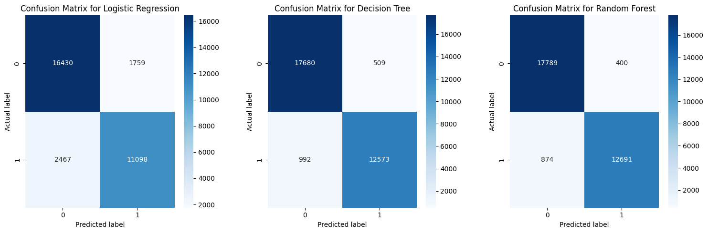

# AI-ML-Project-2023-2024

# Project 1: TRAINS 🚂

### Group members:
- Simone Filosofi (284531)
- Simone Angelo Meli (289631)
- Michele Turco (285251)

## INTRODUCTION ✍️

In the realm of ThomasTrain, our project revolves around deciphering customer satisfaction without directly soliciting feedback. Armed with the "trains_dataset.csv," our mission is to unravel the factors underlying customer contentment. This endeavor holds immense value for our marketing endeavors as it equips us to pinpoint the elements that keep our patrons delighted. Understanding their satisfaction levels allows us to tailor promotions effectively, ensuring a stronger retention rate and fostering lasting relationships with our clientele.

The dataset provided holds the key to unveiling the subtle cues and patterns that contribute to customer satisfaction. By leveraging this dataset, we aim to uncover hidden insights that might not be overtly expressed. These insights will be pivotal for the marketing team's strategic initiatives, enabling them to craft personalized and engaging campaigns. Ultimately, our goal is to use these findings to create a more enriched experience for our customers, fostering loyalty and bolstering our brand's reputation.

Through meticulous analysis of this dataset, we aim to bridge the gap between customer experiences and tangible insights. Our focus on understanding the unspoken factors influencing satisfaction levels will empower us to make informed decisions. By unraveling these nuances, we aspire to transform this understanding into actionable strategies that resonate with our customers, making their journey with ThomasTrain an exceptional one.

## METHODS 🔍

In order to enable readers to better understand the ideas, methods and techniques used in this project, this section will explain the main steps of the project in a more accurate way with respect to the comments that can be found on the main.py file.  
The main python libraries used for this project are:
- pandas: to manipulate the dataset;
- numpy: to perform mathematical operations;
- matplotlib: to plot graphs;
- seaborn: to plot graphs;
- sklearn: to build the models and evaluate their performance;  

The project is divided into 7 main steps, which are described in the following sections.  

### 1) Understanding the dataset
- 1.1)General overview of the dataset: with *'df_trains.head()'* we extracted the first 5 rows of the dataset, to have a general idea of the data we are dealing with;
- 1.2) Showing the dimension of the dataset: We saw that the dataset is composed by 129880 rows and 25 columns, to have a better understanding of the size of the dataset.
- 1.3)Gathering informations from the data: *'df_trains.info()'* allowed us to output the columns' names and data types, and *'df_trains.nunique()'* outputs the number of unique values in each column. In particular, we found out that most of the dtypes were int64(18). We also had the dtype object(6) and float64(1). The object dtype is usually used for strings or where a column contains mixed data types. The float64 dtype is used for floating-point numbers.
- 1.4)Handling missing values: we foud out that 'Arrival Delay in minutes' column has 393 missing values and we substitute these with the mode, even if another option would have been to simply delete the 393 missing values, since they are only a small percentage of the total number of rows.
- 1.5) Data Reduction: assuming they don’t have any predictive power, we removed 'Ticket ID' and 'Date and Time' features. Indeed, as said before, the 'Ticket ID' feature is just an identifier, while the 'Date and Time' feature is not relevant for our analysis, since we are not interested in the time of the day or the day of the week when the customer bought the ticket.

### 2) EDA for feature understanding
As a first step, we had to distinguish categorical and numerical features, since they are treated differently in the EDA. In particular, we found out that there are 5 categorical features and 18 numerical features ("Date and Time"  and "Ticket ID" were removed in the previous step).

- 2.1) **Descriptive statistics**: this statistics summary, unig *'.describe().T*, only considers numerical features and gives a high-level idea to identify whether the data has any outliers, data entry error, distribution of data such as the data is normally distributed or left/right skewed. The results showed what we already knew from the boxplots, that is the presence of outliers in the 'Arrival Delay in Minutes' and 'Departure Delay in Minutes' features. In addittion, we could see that the average is really low for both the features (15 and 14 minutes). Considering the others numerical features, we can observe a balanced distribution, with the average value that is often not so far from the median value.  
After that, we focused on the categorical features, trying to understand how they are distributed and the most frequent value. The names of the columns are pretty self-explanatory:  
  - Ticket class: The class in which the customers chose to travel. **'Premium'** is the most common value, indicating a potential preference.  
  - Loyaly: whether a customer is loyal or not. A significant proportion of the dataset is marked as **'Loyal'**, which could be indicative of a successful loyalty program or repeated use of the service by the customers.  
  - Gender: There is a slight **female majority** 
  - Work or Leisure: Whether a customer is traveling for work reasons or not. There is an higher number of **work-related travels**.
  - Satisfied: Our target variable. **Not Satisfied** is the most common value in the 'Satisfied' column.  
- 2.2) **Univariate Analysis**: univariate analysis scrutinizes individual variables, exploring their distributions and patterns focusing solely on one variable at a time to understand its behavior and properties within a dataset. At first, we plotted histograms for each numerical feature, in order to understand the distribution of the data. The results are reported in the following plot:    
    
The plots show that customer ratings for onboard services generally skewed high, indicating overall customer satisfaction with the ThomasTrain company's services. In contrast, features like 'Food'n'Drink Rating', 'Seat Comfort Rating', and 'Legroom Service Rating' displayed more diverse customer opinions. Both 'Departure Delay in Minutes' and 'Arrival Delay in Minutes' showed a preponderance of short delays, with occasional longer delays that could significantly impact customer satisfaction. The distribution of 'Distance' suggested that most travels were short, but with enough long-distance trips to merit separate consideration for their impact on satisfaction levels.  
After that, we plotted barplots for each categorical feature, in order to visualize the results previously stated:    
  
    
- 2.3) **Outliers detection**: outliers are relevant to build our model since they can negatively affect the performance, so as a first step, we  plotted boxplots in order to have a general idea on what is going on. The results are reported in the following plot:    
    
As we can see, there are many outliers in the 'Arrival Delay in Minutes' and 'Departure Delay in Minutes' features. Even if almost than 75% of the values are less than 10, there are some values that are much higher than the others. In particular, the maximum value for 'Arrival Delay in Minutes' is 1584, while the maximum value for 'Departure Delay in Minutes' is 1592. Another feature that present some outliers is 'Distance', but in this case the outliers are not so relevant, since the maximum value is 4983, which is not so far from the 75% percentile (1359). The other features have a range between 1 and 5, hence the outliers are not so relevant for these features. 
- 2.4) **Encoding Categorical Variables**: we converted categorical variables into a format suitable for modeling, so that it was possible to plot a correlation matrix and understand the relationship between the features and the target variable. Furthermore, there are only 5 categorical features and they are quite easy to encode. Indeed, as seen before, 4 of them are binary variables ('Gender', 'Satisfied', 'Loyalty', 'Work or Leisure'), while the last one has 3 possible values ('Ticket Class'). As a consequence, we decided to use one-hot encoding for the first 4 features and ordinal encoding for the last one. One-hot encoding is used for these variables because it transforms each category into a binary value (0 or 1), creating a new binary column for each category. Label encoding is used for 'Ticket Class' because it represents an ordinal variable with a clear order or hierarchy among the categories ('Economy', 'Smart', 'Premium'). Label encoding assigns a unique numerical value to each category, preserving the order of the classes.
- 2.5) **Correlation Analysis**: evaluates the relationship between categorical, numerical variables and the target variable, to understand which features were more impactful and correlated with the target variable. The results are reported in the following correlation heatmap:    
    
The result on the features 'Age' and 'Gender' is not really surprising, since they are hardly a factor that influences customer satisfaction (maybe they could have been also removed with 'Ticket ID' and 'Date and Time'). On the other hand, the features 'Arrival Delay in Minutes' and 'Departure Delay in Minutes' are commonly considered more relevant and hence a correlation that is so low was not really expected. However, considering the results of the EDA, we can observe that the average value for both the features is really low (15 and 14 minutes), and the distribution is skewed to the left, with a lot of values that are close to 0 and a few values that are much higher than the others. This could explain the low correlation with the target variable: since most of the values are close to 0 the feature had no impact on the customer satisfaction in the most of the cases and hence keeping those features would have been too much resource consuming for the model, without any relevant improvement in the performance.

### 3) Feature selection:
In this section, the only thing we had to decide was the treshold to select features to use to train the model. We simply tried to find the best value empirically, conducting an experiment that is explained in the **Experimental Design** section. The optimal result was obtained with a treshold of 0.15. As a consequence, the features dropped were: 'Gender', 'Arrival Delay in Minutes', 'Departure Delay in Minutes' and 'Age'.  

### 4) Praparing data for modeling
- 4.1) Encoding Categorical Variables: we converted categorical variables into a format suitable for modeling. 
- 4.2) Removing Outliers: we used the two-steps approach to find and remove the outliers for the feature 'Distance'. The reasoning behind the choice of this approach is explained in the **Experimental Design** section.
- 4.3) Data Splitting: we generated a training set containing 75% of the observations and a test set containing the remaining 25%. The training set is used to train the model, while the test set is used to evaluate the model's performance on unseen data.
- 4.4) Distribution of the target variable in the different sets: In order to build a model that is able to perform well on both training and test set, the ratio between the two classes of the target variable must be the same in both sets. The results shows it means that the splitting process kept the ratio constant. As a consequence, we do not have to deal with stratification (splitting the dataset mantaining a balanced ratio between the two classes). 
- 4.5) Feature Scaling (Fit and Transform): Feature scaling, involving the application of fit_transform on the training set and transform on the test set, is performed to standardize the data. This approach ensures that the scaling parameters are learned from the training set, preventing any information leakage from the test set and maintaining the integrity of the model evaluation process. 
- 4.6) Creating a Validation Set: The primary purpose of establishing a distinct validation set is to ensure an impartial evaluation of a model trained on the training dataset. By utilizing a separate validation set, we aim to assess the model's performance on unseen data, preventing potential overfitting to the training set and enhancing the model's ability to generalize to new, unseen observations.

### 5) Model Building
As our target variable, 'Satisfied,' is categorical, and our objective is to predict customer satisfaction with the service, our problem falls into the realm of classification. Specifically, since the outcome can be either 'Yes' (satisfied) or 'No' (not satisfied), it is a binary classification problem. Moving forward, we will analyze the following models for addressing this task:

- **Logistic Regression**
  
- **Classification Trees**
  
- **Random Forest**

- 5.1) Testing Different Models: to gain an initial understanding before tuning, we calculate the training and validation accuracy for all three models using their default parameters. The primary objective is to establish a general performance overview for each model and create a benchmark for later comparison with results obtained after hyperparameter tuning. This initial assessment provides insight into the models' baseline capabilities and sets the stage for evaluating improvements achieved through further optimization.. 
- 5.2) Hyperparameter Tuning using Cross Validation: In our quest to optimize the performance of our models, the initial step involved searching for the best hyperparameters using the RandomizedSearchCV function. This method was chosen for its efficiency in exploring a broad hyperparameter space, with the aim of identifying a promising set that significantly enhances model performance. Following this, with the intent of fine-tuning the models with greater precision, we employed the GridSearchCV function. This approach allowed us to focus on a narrower neighborhood around the values identified in the randomized search, resembling the exploration of a local maximum in the hyperparameter space. The goal was to pinpoint the most optimal combination of hyperparameters for our models within this refined range. The detailed results of these hyperparameter tuning efforts, including the selected parameters, their respective values, and the resulting model performance metrics, can be found in the main notebook. This comprehensive analysis provides insights into the impact of hyperparameter choices on model performance and serves as a valuable reference for refining our models in future iterations.

### 6) Plotting Learning Curves:
Learning curves illustrate how a model's performance evolves as it's trained on varying amounts of data, revealing insights into overfitting, underfitting, and the impact of dataset size on model accuracy. Learning curves are crucial because they show how the model's performance varies with the size of the training set. They can reveal issues such as overfitting or underfitting. In addition, they can help us determine whether collecting more data would be useful. In this section, we are going to visualize and comment the learning curves for each model.
- 6.1) Logistic Regression: The learning curve for the logistic regression model is reported in the following plot:    
    
As we can see, the training score and the cross validation score converges to a value that is not really high, indicating that the model is still not enough complex. However, the fact that the results are the same for both the training and the validation set indicates that the model is not overfitting. 
- 6.2) Decision Tree: The learning curve for the decision tree model is reported in the following plot:    
  
In this plot, we can observe that the training score is always higher than the cross validation score: decision trees are indeed prone to overfitting. However, even if the training score is higher than the cross validation score, the two scores are really close with a large amount of data, indicating that the model is improving its ability to generalize.
- 6.3) Random Forest: The learning curve for the random forest model is reported in the following plot:  
  
In this plot, we can observe that the training score is always higher than the cross validation score: random forests are indeed prone to overfitting. However, in this case the training score is decreasing, indicating that the model is becoming less complex, improving its ability to generalize. In addittion, the performance on unseen data is increasing, indicating, confirming the previous statement.

### 7) Models Evaluation
- 7.1) Classification metrics: quantitative measures (such as accuracy, precision, recall (sensitivity), F1-score, ROC-AUC) we used to assess the performance of our classification models, providing insights into the model's ability to predict classes accurately, detect true positives, and minimize false predictions. In particular, with the methods *'classification_report'* and *'confusion_matrix'* we computed the following metrics:
  - Precision: Precision for a given class in multi-class classification is the fraction of instances correctly classified as belonging to a specific class out of all instances the model predicted to belong to that class. 
  - Sensitivity: Sensitivity in multi-class classification is the fraction of instances in a class that the model correctly classified out of all instances in that class. 
  - F1-score: The F1 score can be interpreted as a harmonic mean of the precision and recall, where an F1 score reaches its best value at 1 and worst score at 0. The relative contribution of precision and recall to the F1 score are equal.
  - Macro Average: Macro-averaging calculates each class's performance metric (e.g., precision, recall) and then takes the arithmetic mean across all classes.
  - Weighted Average: not really useful in this case, since the dataset is balanced.
  - Accuracy: Accuracy is the fraction of instances the model correctly classified out of all instances.
- 7.2) Confusion Matrices: a tabular representation to visualize the performance of a classification algorithm, allowing a clear understanding of true positives, true negatives, false positives, and false negatives. This matrices are fundamental for evaluating a model's precision, recall, accuracy, and other classification metrics.
- 7.3) ROC Curves: (Receiver Operating Characteristic) are graphical representations that illustrate a classification model's performance across various thresholds. They plot the true positive rate (sensitivity) against the false positive rate (1-specificity) for different threshold values, providing a comprehensive overview of a model's ability to distinguish between classes: the area under the ROC curve (AUC-ROC) quantifies the model's overall performance, with a higher AUC indicating better discriminatory power.
- 7.4) Models Comparison:  We give final thoughts about the three classification models we chose, selecting the most suitable model based on the previous results we found and its predictive capabilities. All the results are reported in the **Results** section and commented in the **Conclusions** section.

## EXPERIMENTAL DESIGN

### Choice of Models and Baseline Development: 

- *Logistic Regression*: picked due to its computational efficiency and explanatory power, acting as a fundamental reference point.
- *Decision Trees*:sSelected for their capacity to depict non-linear associations and interpretability, negating the necessity for feature scaling.
- *Random Forest*: an amalgamation of Decision Trees intended to boost efficiency and steadiness, diminishing the likelihood of overfitting while adeptly handling diverse attributes and interactions.

### 1) Handling Outliers

**Objective:**
This experiment aimed to assess the impact of noisy data on the machine learning model's performance. As evident from the Exploratory Data Analysis (EDA), the dataset contains outliers, particularly influencing the features 'Arrival Delay in Minutes' and 'Departure Delay in Minutes.' Conversely, many features exhibit a range between 1 and 5, rendering outliers less influential. The experiment sought to quantify the impact of outliers on various model performances and identify the optimal approach for handling them.

**Baseline(s):**
The baseline for comparison involves evaluating the model's performance without any outlier handling. This baseline serves as a reference point to determine whether the outlier handling approach enhances model performance.

**Evaluation Metric(s):**
Given the absence of a specific optimization goal (e.g., minimizing false positives or false negatives), multiple metrics were considered for assessing model performance. These metrics included accuracy, precision, recall, F1-score, and ROC-AUC score. However, prioritizing the minimization of false positives over false negatives, as predicting a customer as satisfied and later discovering dissatisfaction is deemed less impactful, precision was selected as the primary metric for model evaluation.

### Conclusion:
The most effective approach for handling outliers proved to be their removal. Model performance notably improved when outliers were excluded. However, the specific reason behind this improvement remains unclear, as the dataset (as said before) does not really present anomalous values and hence there is no proper reason for outlier removal. Consequently, a selective removal strategy was adopted, focusing only on outliers within the 'Distance' feature, where certain values significantly deviated from the norm ('Arrival Delay in Minutes' and 'Departure Delay in Minutes' were already removed).

### 2) Hyperparameter Tuning

**Objective:**
This experiment aimed to assess the impact of hyperparameter tuning on the machine learning model's performance.

**Baseline(s):**
The baseline for comparison involves evaluating the model's performance without any hyperparameter tuning. This baseline serves as a reference point to determine whether hyperparameter tuning enhances the model's performance.

**Evaluation Metric(s):**
Consistent with the previous experiment, multiple metrics were considered to evaluate the model's performance, with a particular emphasis on precision.

### Conclusion:
Detailed results, including the optimal hyperparameters for each model, are provided in the main notebook. The preferred approach to hyperparameter tuning involved utilizing the RandomizedSearchCV function to identify a promising set of hyperparameters. Subsequently, the GridSearchCV function was employed to pinpoint the best hyperparameters within a narrower range of values, resembling a local maximum.

### 3) 

#### Evaluation Metrics:

- *Accuracy*: Evaluated the models' comprehensive performance.
- *Precision*: Crucial in reducing false positives in predicting customer contentment.
- *Recall*: Vital in accurately identifying all dissatisfied instances.
- *F1-Score*: Offered a balanced measure encompassing precision and recall, particularly critical in an uneven dataset.
- *ROC-AUC Score*: Assessed the models' capacity to differentiate contented and discontented customers.

All these metrics contributed significantly to a comprehensive model assessment.

## RESULTS 🥇

After the hyperparameter tuning, we evaluated the models' performance using the metrics described above. The results are summarized in the following plot:     
  
 For sake of completness, the actual results are reported in the following table: 

  
  As we can see, each metrics shows that the Random Forest model has the best performance, even if the differences with the Decision Tree model are really small. In order to have a better understanding of the models' performance that is also easy to interpret, we plotted the confusion matrices for each model:    
  
  The confusion matrix plots on the y axis the actual value of the target variable for a given set of features and on the x axis the predicted value. It shows the number of true positives (1 on the y axis and 1 on the x axis), true negatives (0 on the y axis and 0 on the x axis), false positives (0 on the y axis and 1 on the x axis) and false negatives (1 on the y axis and 0 on the x axis). In particular, we can observe that the Random Forest model has the best performance, since it has the highest number of true positives and true negatives, and the lowest number of false positives and false negatives.  
Another relevant metric to evaluate the model's performance is the ROC-AUC score, which is a measure of the model's ability to distinguish between classes. The ROC-AUC score is computed by plotting the true positive rate (sensitivity) against the false positive rate (1-specificity) for different threshold values. The area under the ROC curve (AUC-ROC) quantifies the model's overall performance, with a higher AUC indicating better discriminatory power. The ROC curves for each model are reported in the following plot:     

## CONCLUSIONS 🖋️

## 1) General considerations
In general, the dataset seems to be consistent and well structured, since the models built performed well even on the test set (unseen data), also with great results in the last two models. This is a key factor for the project because each conclusion that could be drawn from the analysis of the dataset is reliable and can be used to improve the customer satisfaction.

## 2) Model comparison
The model with the worst result is linear regression, and we can infere it both by observing the metrics and the confusion matrix. The result is not suprising, since it is highly probable that the dataset is not completely linearly separable. The others two model analyzed, Random Forest and Decision Tree, have similar results, but the Random Forest model is slightly better. In fact, the Random Forest model has a better accuracy, precision, recall and F1-score, and a slightly better ROC-AUC score. However, the computational time of the Random Forest model is much higher than the Decision Tree model, so if we want to train the model on a larger dataset, maybe the Decision Tree model is preferable, especially considering the fact that the differences in the performance of the two models are not so relevant, however, in that case the hyperparameter tuning is even more important to avoid the high risk of overfitting.

## 3) Analysis of the most important features
Since we wanted to actually understand the reasons behind the customer satisfaction, we decided to analyze the most important features for each model, assuming that one of the goal of the project is to improve the overall customer satisfaction and hence to understand in which area improvements are needed the most.  
For random forest and decision tree, feature importance scores represent the contribution of each feature to predictive performance, with a range typically between 0 and 1. In the case of logistic regression, the coefficients indicate the strength and direction of feature influence, with an unbounded range.
The most important features for decision tree and random forests are reported in the following table:  
   
Since the coefficients for the logistic regression are scaled differently from the other two models, we decided to plot the coefficients for the logistic regression model in a separate plot:  
   

